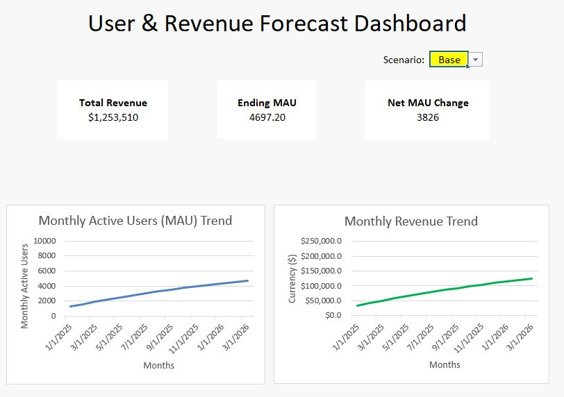

# User & Revenue Forecast Dashboard

This project models and visualizes **Monthly Active Users (MAU)** and **Revenue** for a subscription-based business.  
It combines **Excel** for forecasting and dashboard creation with **R** for historical KPI analysis and data visualization.

---

## 📌 Features
- **Dynamic Excel dashboard** with:
  - Scenario analysis (Base / Best / Worst case)
  - Automated KPIs (Total Revenue, Ending MAU, Net MAU Change)
  - Linked assumptions and forecast logic
  - Interactive charts for MAU and Revenue trends
- **R analysis script** (`churn_analysis.R`) to:
  - Calculate historical MAU, churn rate, and revenue
  - Generate trend visualizations with ggplot2

---

## 🛠 Tools Used
- **Excel** – Financial modeling, dashboard design
- **R** – Data cleaning (dplyr), visualization (ggplot2), date handling (lubridate)

---

## 📂 Repository Contents
forecast_dashboard.xlsx          # Final Excel model + dashboard
subscription_user_revenue_data.csv  # Sample data for R script
churn_analysis.R                 # R code for KPI & churn analysis
sample_dashboard.png             # Dashboard screenshot (optional)

---

## 🚀 How to Use
1. **Excel** – Open `forecast_dashboard.xlsx` and select a scenario from the dropdown.
2. **R** – Run `churn_analysis.R` with `subscription_user_revenue_data.csv` in your working directory.

---

---
